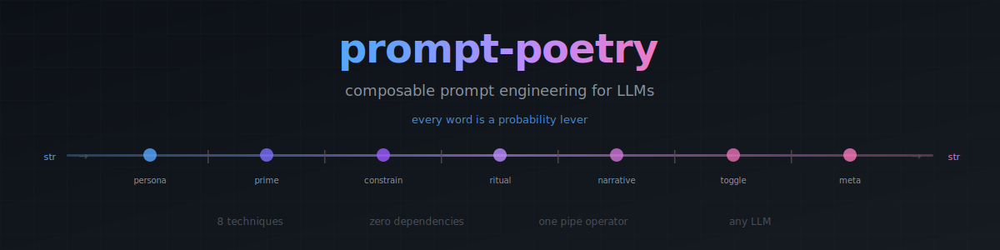

<p align="center">
  
</p>

<p align="center">
  <a href="https://github.com/drewbeyersdorf/prompt-poetry/actions"></a>
  <a href="https://github.com/drewbeyersdorf/prompt-poetry/blob/main/LICENSE"></a>
  
  
  
</p>

<p align="center">
  <strong>8 composable techniques that snap together with <code>|</code> - like Unix pipes for prompt engineering.</strong>
</p>

---

```python
from prompt_poetry import persona, prime, constrain

enhanced = persona("systems architect") | prime("precision") | constrain("under 200 words")
print(enhanced("Design a caching layer"))
```
```
Be meticulous and exact. Double-check every claim. Rigorous accuracy is non-negotiable.

You are a systems architect.

Design a caching layer

Constraints:
- under 200 words
```

One import. One pipe. Zero dependencies. Works with any LLM. **That's it.**

---

## The problem

Prompt engineering today is copy-paste and vibes.

1. You write a prompt
2. You paste in some "best practices" you found on Reddit
3. You tweak words until it kinda works
4. You copy it into every project
5. You can't test it, version it, or compose it

There's no abstraction. No reuse. No composability.

**prompt-poetry fixes this.** Every technique is a function. Functions compose with `|`. You can test them, version them, and snap them together like Legos.

---

## Before / After

<table>
<tr><td width="50%"><strong>❌ Without prompt-poetry</strong></td><td width="50%"><strong>✅ With prompt-poetry</strong></td></tr>
<tr>
<td>

```python
response = client.messages.create(
    model="claude-sonnet-4-20250514",
    messages=[{
        "role": "user",
        "content": "Why did costs increase?"
    }]
)
# Vague question → vague answer
# No persona, no constraints, no structure
# The model guesses what you want
```

</td>
<td>

```python
from prompt_poetry.presets import analyst

response = client.messages.create(
    model="claude-sonnet-4-20250514",
    messages=[{
        "role": "user",
        "content": analyst(
            "Why did costs increase?"
        )
    }]
)
# Precise persona + depth + constraints
# → Commits to an answer, cites evidence
```

</td>
</tr>
</table>

**One line changes your prompt. Zero lines change your LLM call.**

---

## How it works

<p align="center">
  
</p>

Two classes. That's the whole framework:

```python
class Transform:
    """Takes a string, returns a better string."""
    def __call__(self, prompt: str) -> str: ...
    def __or__(self, other) -> Pipeline: ...

class Pipeline(Transform):
    """Chains transforms left to right."""
    def __call__(self, prompt: str) -> str:
        for t in self.transforms:
            prompt = t(prompt)
        return prompt
```

No framework. No config. No dependencies. Transforms in, strings out.

---

## Install

```bash
pip install git+https://github.com/drewbeyersdorf/prompt-poetry.git
```

## The 8 Techniques

Every technique is grounded in how language actually works - in speeches, poetry, negotiations, and therapy. These aren't prompt hacks. They're linguistic principles made composable.

| # | Technique | Principle | Example |
|:---:|-----------|-----------|---------|
| 1 | **persona** | Identity injection - different identity, different probability distribution | `persona("forensic accountant")` |
| 2 | **prime** | Emotional temperature - urgency, precision, creativity as language | `prime("urgency")` |
| 3 | **constrain** | The haiku principle - tighter bounds force better output | `constrain("3 bullets", "no jargon")` |
| 4 | **ritual** | Chain of thought as ceremony - the ritual creates the state | `ritual("step by step")` |
| 5 | **meta** | Recursive self-improvement - the model rewrites its own prompt | `meta()` |
| 6 | **narrative** | Story activates different pathways than instruction | `narrative("postmortem")` |
| 7 | **toggle** | Binary behavioral switches - depth, creativity, confidence | `toggle(depth="deep")` |
| 8 | **constitution** | Persistent identity - your system prompt as composable code | `constitution(role="auditor", rules=[...])` |

<details>
<summary><strong>See each technique with real output ↓</strong></summary>

### 1. Persona - identity injection
Like tuning a radio. Same hardware, different signal.
```python
>>> persona("forensic accountant")("Review these invoices")
'You are a forensic accountant.\n\nReview these invoices'
```

### 2. Primer - emotional temperature
Language-level knobs that work like adjusting temperature.
```python
>>> prime("urgency")("Check the production server")
'This is critical and time-sensitive. Prioritize accuracy and speed. Every detail matters immediately.\n\nCheck the production server'
```

Built-in moods: `urgency`, `precision`, `creativity`, `calm`, `confidence`. Or pass any string.

### 3. Constraint - the haiku principle
Sonnets produced Shakespeare. 14 lines of iambic pentameter - that prison produced the best work.
```python
>>> constrain("3 bullet points", "no jargon")("Explain kubernetes")
'Explain kubernetes\n\nConstraints:\n- 3 bullet points\n- no jargon'
```

### 4. Ritual - chain of thought as ceremony
Monks chant before meditation for the same reason - the ritual creates the state.
```python
>>> ritual("devil's advocate")("Should we migrate to microservices?")
"Before answering, argue the opposite position. Then reconcile both views into your final answer.\n\nShould we migrate to microservices?"
```

Built-in rituals: `step by step`, `show reasoning`, `enumerate`, `devil's advocate`.

### 5. Meta - prompts writing prompts
The model knows its own probability landscape better than you. Ask a river where it wants to flow.
```python
>>> meta()("Write a cold email")
'Before executing the task below, first rewrite it as a clearer, more specific prompt...\n\nOriginal task:\nWrite a cold email'
```

### 6. Narrative - story as structure
Lincoln told parables, not policy papers. A scene gives instinct, a lecture gives theory.
```python
>>> narrative("postmortem")("Why did the deploy fail?")
'Treat this as a postmortem. What happened, why, what was the impact, and what prevents recurrence.\n\nWhy did the deploy fail?'
```

Built-in styles: `case study`, `scene`, `parable`, `briefing`, `postmortem`.

### 7. Toggle - binary switches
```python
>>> toggle(creativity="high", confidence="commit")("Propose a solution")
'Be bold, surprising, and unconventional. Prefer novel approaches. Pick the best option and commit to it. No hedging.\n\nPropose a solution'
```

Dimensions: `verbosity`, `creativity`, `confidence`, `voice`, `depth`.

### 8. Constitution - persistent identity
Your system prompt as composable code.
```python
>>> constitution(role="security auditor", rules=["flag all risks", "cite CVEs"])("Review this PR")
'# Identity\nYou are security auditor.\n\n# Rules\n- flag all risks\n- cite CVEs\n\n# Task\nReview this PR'
```

</details>

---

## Composition

The power is in the pipe. Build reusable prompt pipelines:

```python
from prompt_poetry import persona, prime, constrain, ritual, toggle, narrative

# Debugging pipeline
debug = persona("principal SRE") | prime("precision") | ritual("step by step") | constrain("root cause only")

# Research pipeline
research = persona("investigative journalist") | narrative("case study") | toggle(depth="deep", creativity="high")

# Anti-hallucination RAG
rag = constitution(role="knowledge assistant", rules=["only use provided context", "cite sources"]) | prime("precision")

# Use everywhere
debug("Why is latency spiking on /api/users?")
research("How do top YC companies handle billing?")
rag(f"Question: {q}\n\nContext:\n{chunks}")
```

---

## Presets

12 battle-tested pipelines across engineering, business, and knowledge:

```python
from prompt_poetry.presets import (
    # Engineering
    analyst,             # → commits, cites numbers, goes deep
    debugger,            # → step-by-step, root cause, precise
    researcher,          # → case study, creative, thorough
    evaluator,           # → scoring ritual, no hedging
    writer,              # → casual voice, bold, no jargon
    # Business
    briefer,             # → conclusion first, under 200 words
    ops_reviewer,        # → metrics, enumerate, action items
    meeting_prep,        # → key points, open decisions, owners
    customer_responder,  # → acknowledge first, concrete next step
    financial_analyst,   # → dollar amounts, P&L impact, assumptions
    # Knowledge
    rag_strict,          # → anti-hallucination, cite [N], never guess
    summarizer,          # → compress without losing signal
)
```

See the **[Cookbook](COOKBOOK.md)** for copy-paste recipes.

Extend any preset:
```python
custom = analyst | constrain("under 50 words")
```

---

## CLI

```bash
# Apply a preset
$ prompt-poetry --preset analyst "Why is churn increasing?"

# Mix techniques from the command line
$ prompt-poetry --persona "forensic accountant" --prime urgency "Review these invoices"

# Pipe from stdin
$ echo "Debug the auth flow" | prompt-poetry --preset debugger

# Discover
$ prompt-poetry --list-presets
$ prompt-poetry --list-techniques
```

---

## Works with everything

prompt-poetry enhances the string. It doesn't know or care what LLM you send it to.

<table>
<tr><td><strong>OpenAI</strong></td><td><strong>Anthropic</strong></td><td><strong>Ollama / Local</strong></td></tr>
<tr>
<td>

```python
from openai import OpenAI
from prompt_poetry.presets import analyst

client = OpenAI()
client.chat.completions.create(
    model="gpt-4o",
    messages=[{
        "role": "user",
        "content": analyst("Analyze churn")
    }]
)
```

</td>
<td>

```python
import anthropic
from prompt_poetry.presets import analyst

client = anthropic.Anthropic()
client.messages.create(
    model="claude-sonnet-4-20250514",
    max_tokens=1024,
    messages=[{
        "role": "user",
        "content": analyst("Analyze churn")
    }]
)
```

</td>
<td>

```python
import requests
from prompt_poetry.presets import analyst

requests.post(
    "http://localhost:11434/api/generate",
    json={
        "model": "llama3",
        "prompt": analyst("Analyze churn")
    }
)
```

</td>
</tr>
</table>

---

## Build your own techniques

Subclass `Transform`. That's it. Your techniques compose with everything else:

```python
from prompt_poetry.core import Transform
from prompt_poetry import persona, prime

class Audience(Transform):
    def __init__(self, who: str):
        self.who = who
    def __call__(self, prompt: str) -> str:
        return f"Your audience is {self.who}. Adjust accordingly.\n\n{prompt}"

# Composes with built-in techniques
pipeline = persona("teacher") | Audience("5th graders") | prime("calm")
pipeline("Explain how gravity works")
```

---

## vs. alternatives

| | prompt-poetry | Raw prompts | LangChain Templates | DSPy |
|---|:---:|:---:|:---:|:---:|
| **Composable** | ✅ `\|` pipe | ❌ copy-paste | ⚠️ verbose chains | ✅ modules |
| **Testable** | ✅ pure functions | ❌ | ⚠️ | ✅ |
| **Zero deps** | ✅ | ✅ | ❌ 50+ deps | ❌ |
| **Human-readable** | ✅ reads like prose | ✅ | ❌ YAML/Jinja | ❌ compiled |
| **CLI** | ✅ | ❌ | ❌ | ❌ |
| **Custom techniques** | ✅ subclass | n/a | ⚠️ complex | ⚠️ |
| **Learning curve** | **5 min** | 0 | hours | days |

prompt-poetry is the **missing layer** between raw strings and full frameworks.

---

## The thesis

The same principles that make speeches memorable, poetry powerful, and negotiations effective also make LLM prompts better:

- **Persona framing** works because identity activates different probability distributions - like tuning a radio
- **Emotional priming** works because urgency and precision in natural language act like adjusting temperature
- **Constraints** work because tighter bounds force the model off the beaten path of average completions - sonnets produced Shakespeare
- **Chain of thought** works because forcing intermediate states to exist changes what's possible at the end
- **Narrative scaffolding** works because stories activate different neural pathways than instructions

These aren't prompt tricks. They're how language has always worked. Every prayer, battle cry, and "I have a dream" was a prompt engineered to shift probability distributions in human neural networks.

We just made them composable.

---

## Examples

- **[Cookbook](COOKBOOK.md)** - Copy-paste recipes for meetings, analysis, ops, engineering, RAG
- [`quickstart.py`](examples/quickstart.py) - Run this to see everything in 60 seconds
- [`agent_system.py`](examples/agent_system.py) - Auto-select techniques by task type
- [`rag_pipeline.py`](examples/rag_pipeline.py) - Anti-hallucination RAG with constitution
- [`custom_techniques.py`](examples/custom_techniques.py) - Build your own techniques

---

## Contributing

```bash
git clone https://github.com/drewbeyersdorf/prompt-poetry.git
cd prompt-poetry && pip install -e ".[dev]" && pytest
```

78 tests. 0.04 seconds. Python 3.11 / 3.12 / 3.13.

---

<p align="center">
  <strong>Every word is a probability lever.</strong>
</p>

<p align="center">
  <sub>Built by <a href="https://github.com/drewbeyersdorf">Drew Beyersdorf</a> · battle-tested in production across 21 autonomous agents</sub>
</p>
